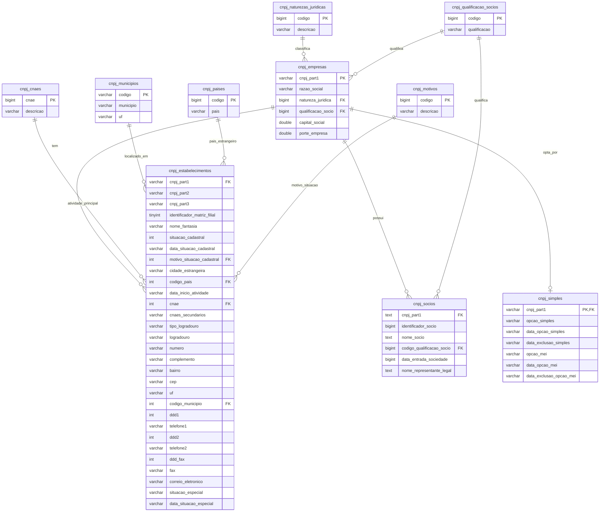

# Análise dos Relacionamentos entre Tabelas CNPJ

## Estrutura das Tabelas e Relacionamentos

### Tabelas Principais:

1. **cnpj_empresas** (Tabela Central)
   - Chave Primária: `cnpj_part1` (8 primeiros dígitos do CNPJ)
   - Campos: razão social, natureza jurídica, qualificação sócio, capital social, porte empresa

2. **cnpj_estabelecimentos** (Tabela de Filiais/Unidades)
   - Chave Estrangeira: `cnpj_part1` → cnpj_empresas.cnpj_part1
   - Campos: CNPJ completo (part1, part2, part3), dados do estabelecimento

3. **cnpj_socios** (Sócios das Empresas)
   - Chave Estrangeira: `cnpj_part1` → cnpj_empresas.cnpj_part1
   - Campos: dados dos sócios e representantes legais

4. **cnpj_simples** (Regime Tributário)
   - Chave Estrangeira: `cnpj_part1` → cnpj_empresas.cnpj_part1
   - Campos: opções do Simples Nacional e MEI

### Tabelas de Referência (Lookup Tables):

5. **cnpj_cnaes** (Atividades Econômicas)
   - Chave Primária: `cnae`
   - Relacionamento: cnpj_estabelecimentos.cnae → cnpj_cnaes.cnae

6. **cnpj_naturezas_juridicas** (Tipos de Empresa)
   - Chave Primária: `codigo`
   - Relacionamento: cnpj_empresas.natureza_juridica → cnpj_naturezas_juridicas.codigo

7. **cnpj_qualificacao_socios** (Tipos de Sócios)
   - Chave Primária: `codigo`
   - Relacionamento: cnpj_empresas.qualificacao_socio → cnpj_qualificacao_socios.codigo
   - Relacionamento: cnpj_socios.codigo_qualificacao_socio → cnpj_qualificacao_socios.codigo

8. **cnpj_municipios** (Cidades)
   - Chave Primária: `codigo`
   - Relacionamento: cnpj_estabelecimentos.codigo_municipio → cnpj_municipios.codigo

9. **cnpj_paises** (Países)
   - Chave Primária: `codigo`
   - Relacionamento: cnpj_estabelecimentos.codigo_pais → cnpj_paises.codigo

10. **cnpj_motivos** (Motivos de Situação Cadastral)
    - Chave Primária: `codigo`
    - Relacionamento: cnpj_estabelecimentos.motivo_situacao_cadastral → cnpj_motivos.codigo

## Diagrama de Relacionamentos

## Resumo dos Relacionamentos

### Relacionamentos 1:N (Um para Muitos):
- **cnpj_empresas** → **cnpj_estabelecimentos**: Uma empresa pode ter múltiplos estabelecimentos
- **cnpj_empresas** → **cnpj_socios**: Uma empresa pode ter múltiplos sócios
- **cnpj_empresas** → **cnpj_simples**: Uma empresa pode ter um registro no Simples (1:1)

### Relacionamentos N:1 (Muitos para Um):
- **cnpj_estabelecimentos** → **cnpj_cnaes**: Muitos estabelecimentos podem ter a mesma atividade principal
- **cnpj_estabelecimentos** → **cnpj_municipios**: Muitos estabelecimentos podem estar no mesmo município
- **cnpj_estabelecimentos** → **cnpj_paises**: Muitos estabelecimentos podem estar no mesmo país
- **cnpj_estabelecimentos** → **cnpj_motivos**: Muitos estabelecimentos podem ter o mesmo motivo de situação
- **cnpj_empresas** → **cnpj_naturezas_juridicas**: Muitas empresas podem ter a mesma natureza jurídica
- **cnpj_empresas** → **cnpj_qualificacao_socios**: Muitas empresas podem ter a mesma qualificação
- **cnpj_socios** → **cnpj_qualificacao_socios**: Muitos sócios podem ter a mesma qualificação

### Observações Importantes:
1. A tabela `cnpj_empresas` é o centro do sistema, contendo os dados básicos da empresa
2. A tabela `cnpj_estabelecimentos` contém os dados específicos de cada unidade/filial
3. As tabelas de referência (lookup) normalizam os dados e evitam redundância
4. O CNPJ completo é formado pela concatenação de `cnpj_part1 + cnpj_part2 + cnpj_part3`
